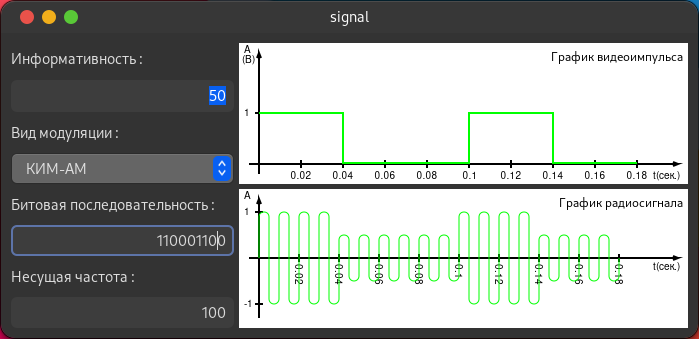

# signal

### Migarted to https://github.com/KonstantIMP/radio 

Signal is a program for modulating and displaying the received signal



## Supported modulating types

  - Frequency modulating
  - Amplitude modulating
  - Phase modulating

## Usage

### Linux build

1. Install dependencies

```sh
    #For Ubuntu
    sudo apt install libgtkd-3-dev meson ninja-build ldc
    #For Arch
    sudo pacman -S dlang meson ninja gtkd
```

2. Clone repo and build project

```sh
    git clone https://github.com/KonstantIMP/signal.git

    cd signal
    meson . _build
    ninja -C _build
```

3. Run the app

```sh
    ./_build/signal
```

### Windows usage

Download latest release from project`s page on GitHub and run .exe
